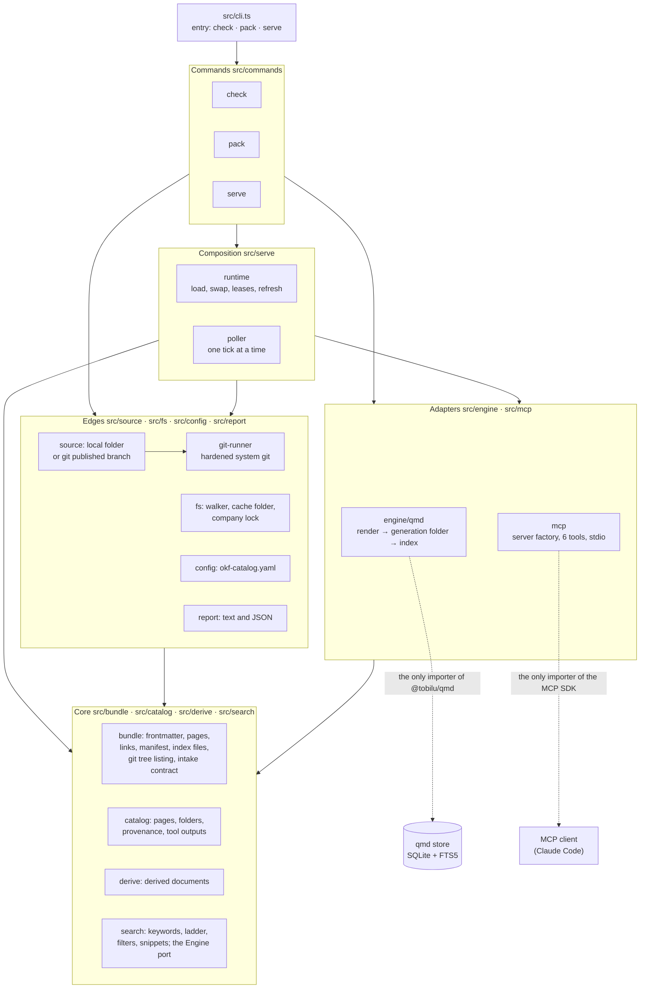
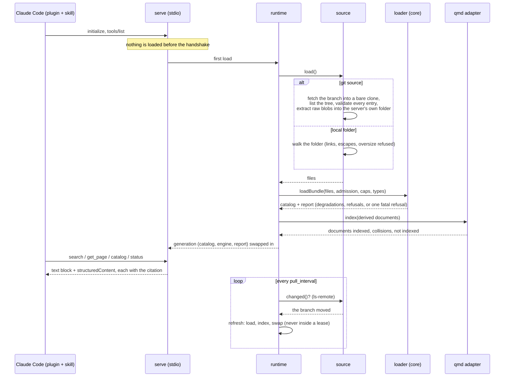

# Architecture

One company, one process: `okf-catalog serve` reads one company's configuration, fetches that company's published bundle into a cache folder of its own, applies the intake contract, writes derived copies of the admitted pages into a qmd index, and answers an MCP client over stdio with six read-only tools. `pack` produces the published bundle from a source checkout; `check` prints the contract's report for a folder. The design is in [intent.md](intent.md); every decision behind it is in [decisions/0001-founding-decisions.md](decisions/0001-founding-decisions.md); the bite-by-bite plan, its reviews and the build record are in [plans/](plans/).

## Layers

The code is layered so that the OKF logic can be read and tested without qmd, the MCP SDK or the file system in the picture. The rule is enforced by dependency-cruiser in CI (`.dependency-cruiser.cjs`), and the suite proves the rule bites by planting violations.

| Layer | Folders | May import | Must not import |
|---|---|---|---|
| Core | `bundle`, `catalog`, `derive`, `search` | each other; `node:crypto`, `node:path`, `node:url`; `yaml`, `zod`, the mdast utilities | the file system, processes, the network, qmd, the MCP SDK |
| Adapters | `engine/qmd`, `mcp` | the core; their one library each | each other; the edges; the commands |
| Edges | `source`, `fs`, `config`, `report` | the core; Node | the adapters; the commands |
| Composition | `serve` | everything but the commands | the commands |
| Commands, entry | `commands`, `cli.ts` | everything | |

## What happens when a client asks

- **The intake contract** (`bundle/contract.ts`, `bundle/load.ts`): every page is read by the specification's field table. Missing optional fields, unknown types, broken links and missing index files degrade and are reported, never refused (OKF 0.2 §11). Refused: a page with no frontmatter or no `type`, symbolic links, path escapes, oversize files, a hash that disagrees with the manifest, a missing manifest when integrity is required.
- **The derived copy** (`derive/`, `engine/qmd-render.ts`): the server never points qmd at the bundle. Each admitted page becomes a document with a `# title` line, the description, type and tag lines, and the body; `get_page` serves the original. Paths go through a codec so folders qmd would skip still round-trip.
- **Search** (`search/`): keywords, English stopwords dropped, a relaxation ladder (every term, then one query per term fused by summed BM25), the type, topic, tag, status, trust and overdue filters applied by the server to what the engine returns, with its own candidate pool (only the type and topic reach the query, as words of the first rung; no filter moves an engine rank, and the rank guard of `bench/expected/lexical-ranks.json` checks it in CI), overdue pages included and flagged unless the caller asks for fresh ones, and every hit carrying path, trust tier, verifier, recheck date, source count and resource. `get_page` reads a page's path or its concept id through one resolver (`catalog/resolve.ts`).
- **Citations and provenance** (`bundle/markdown.ts`, `bundle/path-field.ts`, `catalog/model.ts`, `catalog/graph.ts`): the loader keeps each body link's text and nearest heading and each footnote reference's block, classifies every admitted page's path fields once admission is known, and builds the inbound links and derivations with the catalog, per bundle; `citations` and `provenance` read only those, through `get_page`'s resolver. Nothing is fetched, indexed or stored apart from the catalog, no rank moves, and every result of `get_page`, `citations` and `provenance` is held, text and structured, within the 40 000-character budget.
- **One process per company** (`fs/company-lock.ts`, `fs/cache-dir.ts`): the cache folder is created with mode 0700 and refused when it is a link, another user's or writable by others; a second server on the same company falls back to a private folder and names the holder.
- **Git as transport only** (`source/git.ts`, `source/git-runner.ts`, `bundle/git-tree.ts`): a bare shallow clone, every fetched tree listed and validated before anything is written (links, gitlinks, oversize blobs, unsafe or `.git`-like or colliding paths refuse the whole commit), raw blobs extracted into the server's own folder, no checkout, hooks and prompts and filters disabled, a process group killed on timeout.

## The publish loop

```mermaid
flowchart LR
  co["source checkout<br/>(pages, drafts, attachments)"] --> chk1["OKF checkers<br/>(okflint, okf-schema, on the company's say-so)"]
  chk1 --> pack["okf-catalog pack<br/>admitted pages, index files, manifest"]
  pack --> chk2["checkers again<br/>on the packed folder"]
  chk2 --> push["push.sh<br/>parent-linked commit, no force"]
  push --> branch[("published branch")]
  branch -- "pull_interval" --> server["serve<br/>fetch, validate, extract, re-index, swap"]
  server --> cc["Claude Code<br/>next answer from the new text"]
```

`recipes/publish/publish.yml` is the GitHub Actions workflow a company copies: a read-only job runs the checkers and `pack` without the checkout's credentials, a second job holding the write token runs git alone.

## Where things live on disk

| Path | What |
|---|---|
| `$XDG_CACHE_HOME/okf-catalog/<company>/` (or the platform cache folder) | the company's cache: `lock.sqlite`, `source/` (the bare clone and the extracted tree), the qmd store and its generation folders, `private/<pid>/` for a second process |
| `okf-catalog.yaml` | the company's configuration: name, source, admission, pull interval, caps, declared types, specification text |
| `plugin/claude-code/` | the Claude Code plugin: the server launch and the skill that tells Claude to search with keywords, read pages whole and cite path, trust, verifier and recheck date |
| `bench/` | the benchmark corpus tooling and the lexical-versus-full measurement harness; `bench/acceptance/` the scripts of the acceptance runbook |

## Invariants the tests hold

Company isolation end to end; nothing fetched is executed; stdout carries nothing but the protocol; a bundle is never refused for what the specification calls optional; page bodies are data (the skill says so, the marker line says so, and the acceptance runs show it); no global installs and no model download without the maintainer's own step; the repository holds no company content.
